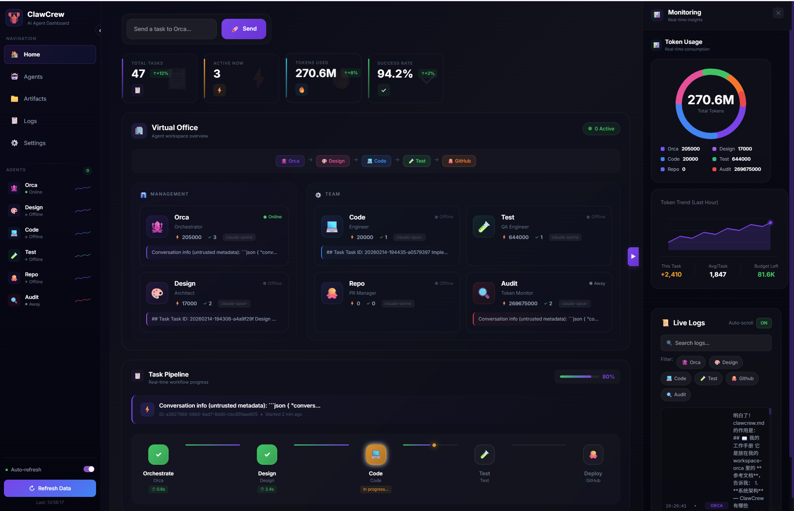

# ClawCrew.md

> 🦞 A framework for building collaborative AI agent teams on OpenClaw

---

## 🎯 What is ClawCrew?

ClawCrew is a **framework** for creating multi-agent teams that collaborate on tasks. Instead of one AI doing everything, you define specialized agents with focused roles, and an orchestrator coordinates their work.

**Each agent evolves independently.** You can train and tune each agent's capabilities separately — refine the designer's taste, sharpen the coder's style, improve the tester's coverage. They grow as individuals.

**You're the manager.** In Telegram (or any IM), you talk to the orchestrator and watch every agent work in real-time. Jump in anytime — give feedback, correct course, or let them run. Define team workflows and standards, then step back and let them deliver. It's like running a team or a company, except your employees are AI.

**The magic:** Each agent's capabilities are defined by its workspace — `SOUL.md`, `AGENTS.md`, skills, and tools. Change the workspace, change the agent.

**Watch them work in real-time — right in your chat.**

<picture>
  <source media="(prefers-color-scheme: dark)" srcset="docs/images/dashboard_dark.png">
  <source media="(prefers-color-scheme: light)" srcset="docs/images/dashboard_light.png">
  
</picture>

---

## 💡 Core Concept

```
┌──────────────────────────────────────────────────────────────┐
│                     ClawCrew Framework                        │
├──────────────────────────────────────────────────────────────┤
│                                                              │
│   Orchestrator Agent (workspace_orca/)                       │
│   ├── SOUL.md       → Personality & rules                    │
│   ├── AGENTS.md     → Behavior guidelines                    │
│   ├── ClawCrew.md   → Team structure & roles  ⭐             │
│   └── skills/       → Available capabilities                 │
│                                                              │
│         │ spawns                                             │
│         ▼                                                    │
│   ┌──────────────┐  ┌──────────────┐  ┌──────────────┐      │
│   │   Agent A    │  │   Agent B    │  │   Agent C    │      │
│   │ workspace_A/ │  │ workspace_B/ │  │ workspace_C/ │      │
│   └──────────────┘  └──────────────┘  └──────────────┘      │
│                                                              │
│   Each agent = unique workspace = unique capabilities        │
│                                                              │
└──────────────────────────────────────────────────────────────┘
```

> 📄 **[ClawCrew.md](https://clawcrew.md)** — The team definition file lives in the orchestrator's workspace.  
> It describes all roles, workflows, and standards for your agent team.  

**Key insight:** The framework doesn't define what agents do — **workspaces do**.

---

## 🎨 Example Teams

### 1. Software Dev Team

```
🦑 OrcaBot (Orchestrator)
    ├── 🎨 DesignBot  → API design, types, specs
    ├── 💻 CodeBot    → Implementation
    └── 🧪 TestBot    → Testing, coverage
```

**Use case:** Automated code generation with quality gates

---

### 2. Research Team

```
📚 ResearchLead (Orchestrator)
    ├── 🔍 SearchBot   → Web research, data gathering
    ├── 📊 AnalystBot  → Data analysis, insights
    └── ✍️ WriterBot   → Report writing, summaries
```

**Use case:** Deep research with structured output

---

### 3. Content Team

```
🎬 ContentLead (Orchestrator)
    ├── 💡 IdeaBot      → Brainstorming, concepts
    ├── ✏️ DraftBot     → Writing first drafts
    ├── 🔍 EditorBot    → Review, polish, fact-check
    └── 📊 AnalyzerBot  → Monitor engagement (clicks, replies, shares)
```

**Use case:** Blog posts, marketing copy, documentation with performance tracking

---

### 4. Customer Support Team

```
🎯 SupportLead (Orchestrator)
    ├── 🔍 TriageBot   → Categorize, prioritize
    ├── 💬 ReplyBot    → Draft responses
    └── 📈 EscalateBot → Complex issue handling
```

**Use case:** Automated support ticket handling

---

## 👥 Software Dev Team (Full Example)

This example shows a complete software development crew.

### Team Structure

```
┌─────────────────────────────────────────────────────────┐
│                                                         │
│                    🦑 OrcaBot                           │
│                   (Orchestrator)                        │
│                                                         │
│    "I break down tasks, delegate work, and ensure      │
│     quality at every step."                            │
│                                                         │
└─────────────────────────────────────────────────────────┘
                          │
          ┌───────────────┼───────────────┐
          │               │               │
          ▼               ▼               ▼
    ┌───────────┐   ┌───────────┐   ┌───────────┐
    │           │   │           │   │           │
    │ 🎨 Design │   │ 💻 Code   │   │ 🧪 Test   │
    │    Bot    │   │    Bot    │   │    Bot    │
    │           │   │           │   │           │
    └───────────┘   └───────────┘   └───────────┘
```

### Agent Roles

| Agent | Role | Deliverables |
|-------|------|--------------|
| 🦑 **OrcaBot** | Orchestrator | Task breakdown, quality gates, final delivery |
| 🎨 **DesignBot** | Architect | API specs, types, edge cases |
| 💻 **CodeBot** | Engineer | Implementation, docstrings |
| 🧪 **TestBot** | QA | Unit tests, coverage report |

### Workflow

```
USER REQUEST
     │
     ▼
┌─────────────────────┐
│  PHASE 1: DESIGN    │  OrcaBot → spawns → DesignBot
│  Output: API spec   │  OrcaBot reviews → ✅
└─────────────────────┘
     │
     ▼
┌─────────────────────┐
│  PHASE 2: CODE      │  OrcaBot → spawns → CodeBot
│  Output: module.py  │  OrcaBot reviews → ✅
└─────────────────────┘
     │
     ▼
┌─────────────────────┐
│  PHASE 3: TEST      │  OrcaBot → spawns → TestBot
│  Output: tests.py   │  OrcaBot reviews → ✅
└─────────────────────┘
     │
     ▼
┌─────────────────────┐
│  FINAL DELIVERY 🚀  │
│  • Code + Tests     │
│  • 100% coverage    │
│  • Documentation    │
└─────────────────────┘
```

---

## 🚀 Getting Started

> **Prerequisites:** OpenClaw already installed and configured.
> See [OpenClaw docs](https://docs.openclaw.ai) for installation.

### Option A: One-Click Install (Recommended)

```bash
curl -sSL https://raw.githubusercontent.com/lanxindeng8/clawcrew/main/install.sh | bash
```

This will:
1. Check and install dependencies (Python 3.10+, pip, jq)
2. Install ClawCrew via pip
3. Run the interactive setup wizard

### Option B: Install via pip

```bash
pip install clawcrew
clawcrew init
```

### Option C: Docker

```bash
git clone https://github.com/lanxindeng8/clawcrew
cd clawcrew
cp .env.example .env  # Edit with your Telegram credentials
docker-compose up -d
```

### Option D: Manual Setup

#### Step 1: Create Telegram Bot

Only need **1 bot** for all agents.

1. Message [@BotFather](https://t.me/BotFather) → `/newbot`
2. Get your bot token
3. **Important:** Disable privacy mode
   - `/mybots` → Select your bot → Bot Settings → Group Privacy → **Turn off**
   - This lets the bot see all messages in groups

#### Step 2: Create Telegram Group

1. Create a group called "OpenClaw Dev" (or any name)
2. Add your bot to the group
3. Get the group's `chat_id`

#### Step 3: Clone & Configure

```bash
git clone https://github.com/lanxindeng8/clawcrew
cd clawcrew
./setup.sh
```

### Start the Crew

```bash
clawcrew start   # or: openclaw gateway restart
clawcrew status  # Check if everything is running
```

### Send a Task

In your Telegram group:
```
Create a Python module to calculate distance between two points
```

Or use the CLI:
```bash
clawcrew chain "Create a distance calculator module" design code test
```

---

## 💻 CLI Reference

### Core Commands

| Command | Description |
|---------|-------------|
| `clawcrew init` | Interactive setup wizard |
| `clawcrew start` | Start the OpenClaw gateway |
| `clawcrew stop` | Stop the gateway |
| `clawcrew status` | Show system and agent status |
| `clawcrew agents` | List available agents |

### Running Agents

```bash
# Run a single agent
clawcrew run design -t "Design a REST API for users"

# Run with context file
clawcrew run code -t "Implement the API" -c design.md -o api.py

# Chain multiple agents (auto context passing)
clawcrew chain "Create user authentication" design code test
```

### GitHub Integration

```bash
clawcrew github analyze --url https://github.com/user/repo
clawcrew github issues -r user/repo
clawcrew github read-issue -r user/repo -n 123
clawcrew github create-pr -r user/repo -t "Fix bug" -H fix-branch
```

### Memory Management

```bash
clawcrew show-memory -a design    # Show agent's memories
clawcrew clear-memory -a design   # Clear today's memories
clawcrew clear-memory -a design --all  # Clear all memories
```

---

## 🛠 Build Your Own Team

### 1. Define Your Orchestrator

Create `workspace-orchestrator/SOUL.md`:
```markdown
# SOUL.md

You are the team lead. When you receive a task:
1. Break it into phases
2. Spawn the right agent for each phase
3. Review each deliverable
4. Deliver final results
```

### 2. Define Specialized Agents

Create `workspace-agent-a/SOUL.md`:
```markdown
# SOUL.md

You are a specialist in [SKILL].
When given a task:
1. Focus only on your expertise
2. Deliver high-quality output
3. Report back to the orchestrator
```

### 3. Configure Routing

Set up OpenClaw to route to your orchestrator.

### 4. Run Your Team

Send a task and watch your custom team collaborate!

---

## 🔗 GitHub Integration

ClawCrew includes **GitHubBot** — a specialized agent for GitHub workflows.

### Capabilities

| Feature | Description |
|---------|-------------|
| **Repository Analysis** | Analyze repos to understand architecture, tech stack, and key files |
| **Issue Management** | List and read GitHub issues for development context |
| **PR Workflow** | Create, list, and read Pull Requests |

### Quick Examples

```bash
# Analyze a repo
./bin/agent-cli.py summarize-repo --url https://github.com/user/repo

# Read an issue
./bin/agent-cli.py read-issue -r user/repo -n 123 --comments

# Create a PR
./bin/agent-cli.py create-pr -r user/repo -t "Fix bug" -H fix-branch
```

**Full documentation:** See [workspace-github/SOUL.md](workspace-github/SOUL.md) for complete command reference and workflow examples.

---

## 🔮 Roadmap

### Current
- [x] Multi-agent orchestration pattern
- [x] Software Dev Team example
- [x] Quality gates between phases
- [x] Real-time chat visibility

### Framework Core (Next)

**Team Management**
- [ ] Easy onboarding — add new agents with simple config
- [ ] Role templates — pre-defined SOUL.md for common roles
- [ ] Hot reload — update agent capabilities without restart

**Team Collaboration**
- [ ] Shared context — team members access common knowledge base
- [ ] Internal handoffs — structured data passing between agents
- [ ] Team memory — persistent learnings across sessions

**Team Operations**
- [ ] Workflow editor — define pipelines visually
- [ ] Progress tracking — see task status across agents
- [ ] Quality metrics — success rates, iteration counts, costs

### Multi-Team (Future)

- [ ] Team-to-team communication
- [ ] Shared resource pools
- [ ] Cross-team orchestration
- [ ] Organization-level policies

### Software Dev Team (Priority)

Since this is the most common use case for developers:

**GitHub Integration**
- [x] Repo onboarding — Orca reads new repo, summarizes architecture, shares with team
- [x] Issue → Task — GitHub issues automatically become team tasks
- [x] PR workflow — CodeBot creates PR, TestBot validates, Orca merges
- [ ] Code review — team reviews external PRs

**Dev Workflow**
- [ ] Multi-file projects — coordinate changes across files
- [ ] Dependency awareness — understand imports and relationships
- [ ] Incremental builds — work on existing codebases
- [ ] CI/CD hooks — trigger builds, handle failures

---

## 📄 License

MIT License — See [LICENSE](LICENSE)

---

## 🔗 Links

- **Website:** [clawcrew.md](https://clawcrew.md)
- **GitHub:** [github.com/lanxindeng8/clawcrew](https://github.com/lanxindeng8/clawcrew)
- **OpenClaw:** [openclaw.ai](https://openclaw.ai)
- **Discord:** [discord.gg/clawd](https://discord.gg/clawd)

---

*Built with 🦞 OpenClaw — Your personal AI assistant*
